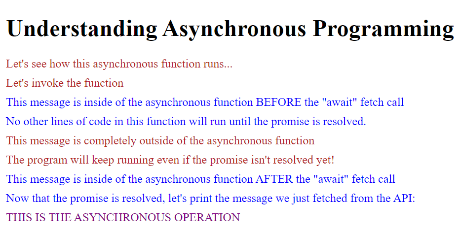

# Understanding Asynchronous Operations

This is a quick simple application designed to help anyone (myself included) understand how a program operates when asynchronous operations are involved. The primary focus of this application is on demonstrating the concept of async/await, which is a part of JavaScript's modern syntax for handling promises.

### Wait, What is an Asynchronous Operation, Anyway?
In the context of JavaScript, asynchronous operations allow the program to perform non-blocking operations-- so it can continue executing other parts of the code without waiting for an operation to complete. This is especially useful when dealing with network requests or file system operations, where delays can occur. Ever been in a drive-thru where the cashier asked you to pull up ahead because your order wasn't ready? They ask that so that everyone else in the line won't have to wait longer just because you ordered the most complicated burrito on the menu. While your order was being prepared, they went ahead and put together the small taco and drink for the person behind you in line. This is essentially what an asynchronous operation allows a program to do. The line of cars can keep on flowing and won't get backed up.

Sometimes, however, we need to keep things more linear. Let's say you have a friend with you at the taco shop, but they don't want to decide what to order until they see how you meal turns out. They are going to **AWAIT** the arrival of your meal and then carry on with their difficult decision making from there.

## How it works
In this application, we're using the fetch function to simulate a network request to a local API endpoint [http://localhost:8088/messages](http://localhost:8088/messages). This function returns a _Promise_ that resolves to the _Response_ object representing the response to the request.

We define an asynchronous function called `fetchedMessage`. Inside this function, we use the _await_ keyword to pause the execution of the function until the Promise returned by fetch is resolved.

When the application starts, it first appends a message to the `#container` HTML element. It then defines and invokes the `fetchedMessage` function. Inside this function, before the fetch call, another message is appended to the container. After the fetch call, the function **waits** for the Promise to resolve, then appends another message to the container along with the fetched messages.

Meanwhile, the rest of the program continues to execute. Even though the fetch call hasn't completed yet, the application still appends a couple of messages to the container. This demonstrates that the JavaScript event loop is able to handle other tasks while waiting for the Promise to resolve.

The data fetched from the local API is an array of objects, each containing an id and a word. These words are then concatenated to display the message `THIS IS THE ASYNCHRONOUS OPERATION` in the `#container` HTML element.

**Here is the code**:
```JavaScript
import { delay } from "./helpers/delay.js";

// First, we'll append each message, one at a time, to our HTML element "#container"
const container = document.querySelector("#container");
container.innerHTML += `<div class="outsideFunction">Let's see how this asynchronous function runs...</div>`;

// Next, let's define our async/await function that we will use to make a fetch to the local API 
const fetchedMessage = async () => {
    container.innerHTML += `<div class="inFunction">This message is inside of the asynchronous function BEFORE the "await" fetch call</div>
                            <div class="inFunction">No other lines of code in this function will run until the promise is resolved.</div>`;
    
    const response = await fetch("http://localhost:8088/messages");
    const messages = await response.json();

    /*This helper function adds a 1/2 second delay to simulate a slower network*/
    await delay(500)

    container.innerHTML += `<div class="inFunction">This message is inside of the asynchronous function AFTER the "await" fetch call</div>`;

    container.innerHTML += `<div class="inFunction">Now that the promise is resolved, let's print the message we just fetched from the API:</div>`;

    let fetchedMessage = `<div id="secretMessage">`;
    let divStringArray = messages.map(
        (message) => {
            return message.word;
        }
    );
    // Print the fetched message
    fetchedMessage += `${divStringArray.join("")}</div>`;
    container.innerHTML += fetchedMessage;
};

// We'll invoke the function here
container.innerHTML += `<div class="outsideFunction">Let's invoke the function</div>`;
fetchedMessage();

/* Here are some messages that are outside of the async/await function to show that the program
will keep running */
container.innerHTML += `<div class="outsideFunction">This message is completely outside of the asynchronous function</div>`;
container.innerHTML += `<div class="outsideFunction">The program will keep running even if the promise isn't resolved yet!</div>`;
```
**And heres the output**



Now try it yourself and play around with it! 

**Tip:** Try putting an `await` keyword in front of where `fetchedMessage()` is invoked and see what happens!

## Getting started
1. Pull down the repository
2. Make sure you have a setup for a local web server. If not, use npm to install one

```bash
npm install -g serve
```

3. You will also need `json-server` to serve the database.json files and simulate an API

```bash
npm install -g json-server
```
4. Open the project in two terminal windows
5. In the first window, navigate to the `/api` directory and run

```bash
json-server database.json -p 8088
```
This will start up a mock server running on port 8088

6. In the other terminal at the project root, simply run
```bash
serve
```

7. Now you should be able to view the project in the browser at `http://localhost:3000`